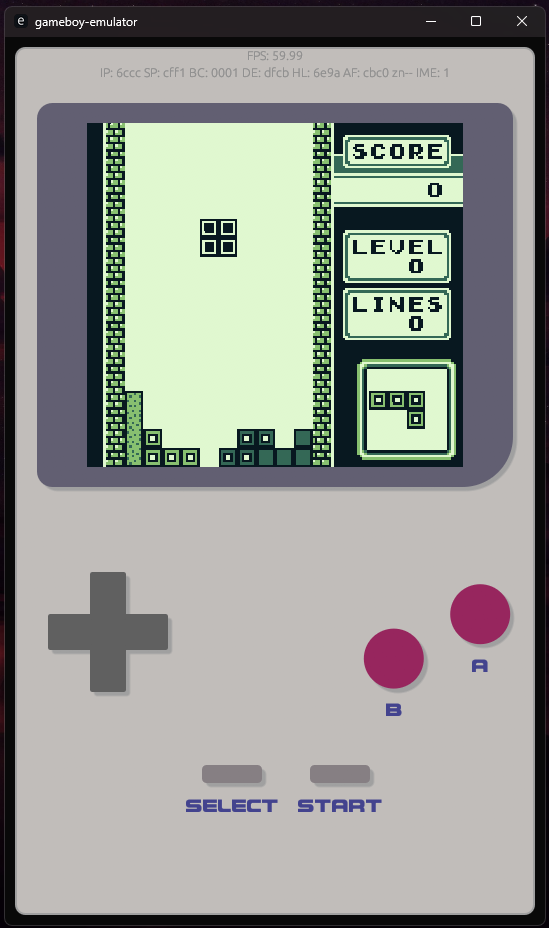

# gameboy-emulator
A simple GameBoy emulator written in Rust just for fun

## Current State:

The emulator can make it through the Boot ROM successfully and enter a game. The Nintendo logo scrolls down from the top of the screen.
Both keyboard and click inputs are functional. It can fully execute the dmg-acid2 test for testing the graphics emulation.

## Progress:

- [ ] MVP
    - [x] Cartridge header reading
    - [x] Cartridge reading
    - [x] Instruction decoding
    - [x] Instruction execution
    - [x] Execute Boot ROM
    - [ ] Execute all cpu_instrs.gb tests
    - [x] Execute dmg-acid2.gb
    - [ ] Play Tetris

- [x] Instruction decoding
    - [x] All instruction opcodes
    - [x] All instruction arguments
    - [x] All instruction lengths
- [x] Instruction execution
    - [x] Block 0
        - [x] nop
        - [x] ld r16, imm16
        - [x] ld \[r16mem\], a
        - [x] ld a, \[r16mem\]
        - [x] ld \[imm16\], sp
        - [x] inc r16
        - [x] dec r16
        - [x] add hl, r16
        - [x] inc r8
        - [x] dec r8
        - [x] ld r8, imm8
        - [x] rlca
        - [x] rrca
        - [x] rla
        - [x] rra
        - [x] daa
        - [x] cpl
        - [x] scf
        - [x] ccf
        - [x] jr imm8
        - [x] jr cond, imm8
        - [x] stop
    - [x] Block 1: 8-Bit Register-to-Register Loads
        - [x] ld r8, r8
        - [x] halt
    - [x] Block 2: 8-Bit Arithmetic
        - [x] add a, r8
        - [x] adc a, r8
        - [x] sub a, r8
        - [x] sbc a, r8
        - [x] and a, r8
        - [x] xor a, r8
        - [x] or a, r8
        - [x] cp a, r8
    - [x] Block 3
        - [x] add a, imm8
        - [x] adc a, imm8
        - [x] sub a, imm8
        - [x] sbc a, imm8
        - [x] and a, imm8
        - [x] xor a, imm8
        - [x] or a, imm8
        - [x] cp a, imm8
        - [x] ret cond
        - [x] ret
        - [x] reti
        - [x] jp cond, imm16
        - [x] jp imm16
        - [x] jp hl
        - [x] call cond, imm16
        - [x] call imm16
        - [x] rst tgt3
        - [x] pop r16stk
        - [x] push r16stk
        - [x] ldh \[c\], a
        - [x] ldh \[imm8\], a
        - [x] ld \[imm16\], a
        - [x] ldh a, \[c\]
        - [x] ldh a, \[imm8\]
        - [x] ld a, \[imm16\]
        - [x] add sp, imm8
        - [x] ld hl, sp + imm8
        - [x] ld sp, hl
        - [x] di
        - [x] ei
    - [x] 0xCB Prefixed Instructions
        - [x] rlc r8
        - [x] rrc r8
        - [x] rl r8
        - [x] rr r8
        - [x] sla r8
        - [x] sra r8
        - [x] swap r8
        - [x] srl r8
        - [x] bit b3, r8
        - [x] res b3, r8
        - [x] set b3, r8
- [ ] CPU Instructions Tests
    - [x] 01 - Special
    - [ ] 02 - Interrupts
    - [ ] 03 - op sp, hl
    - [x] 04 - op r, imm
    - [ ] 05 - op rp
    - [x] 06 - ld r, r
    - [x] 07 - jr, jp, call, ret, rst
    - [x] 08 - Misc Instructions
    - [x] 09 - op r, r
    - [x] 10 - Bit Ops
    - [x] 11 - op a, (hl)
- [ ] Memory Map
    - [x] Boot ROM
    - [x] Cartrige ROM Bank 0
    - [x] Cartrige ROM Bank 1
    - [ ] Cartridge ROM Bank Swapping
    - [x] VRAM
    - [ ] Cartridge RAM
    - [ ] ~~Cartridge RAM Bank Swapping~~
    - [x] Work RAM Bank 0
    - [x] Work RAM Bank 1
    - [ ] Echo RAM
    - [x] OAM RAM
    - [x] HRAM
    - [x] Interrupt Enable Register
- [ ] GUI
    - [x] Window
    - [x] Device outline
    - [x] Display
    - [x] Buttons
    - [ ] Decorative text / details
    - [x] Keyboard inputs
- [x] Graphics
    - [x] Reading tiles from VRAM
    - [x] Placing tiles based on tile map
    - [x] Display background
    - [x] Background palette
    - [x] Background enable flag
    - [x] Background tile map select
    - [x] Background tile data select
    - [x] Display window
    - [x] Window enable flag
    - [x] Window tile map select
    - [x] Window internal line counter
    - [x] Window Y movement
    - [x] Window X movement
    - [x] Scroll Y movement
    - [x] Scroll X movement
    - [x] Display tile
    - [x] Read object attributes
    - [x] Display objects
    - [x] Object palette
    - [x] Object horizontal flip
    - [x] Object vertical flip
    - [x] Object to background priority
    - [x] Object enable flag
    - [x] Object size support
    - [x] Object order priority
    - [x] 10 objects per line draw limit
- [x] I/O Registers
    - [x]  Joypad Input
    - [x]  Serial transfer
    - [x]  Timer and Divider
    - [x]  Interrupts
    - [x]  Audio
    - [x]  Wave Pattern
    - [x]  LCD / Display
    - [ ]  ~~VRAM Bank Select~~ (CGB)
    - [x]  Boot ROM Enable
    - [x]  OAM DMA
    - [ ]  ~~VRAM DMA~~ (CGB)
    - [ ]  ~~LCD Color Palettes~~ (CGB)
    - [ ]  ~~WRAM Bank Select~~ (CGB)
- [x] Cartridge Header Reading
    - [x] Entry Point
    - [x] Nintendo Logo
    - [x] Title
    - [x] Manufacturer Code
    - [x] ~~Color GameBoy Flag~~
    - [x] New Licensee Code
    - [x] ~~Super GameBoy Flag~~
    - [x] Cartridge Type
    - [x] ROM Size
    - [x] RAM Size
    - [x] Destination Code
    - [x] Old Licensee Code
    - [x] Mask ROM Version Number
    - [x] Header Checksum
    - [x] Global Checksum
    - [x] Header Checksum Calculation
    - [x] Global Checksum Calculation (Optional)